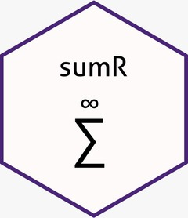

# sumR 

Approximate infinite series with a guaranteed error margin!

# Installation
Installing this package in R from this GitHub page is straightforward. Make sure you have the package `devtool` installed and that your Operating System has a C compiler that R can access. This is automatically true in a standard installation in Linux, requires Xcode or gcc (depends on MacOS version) in Mac, and Rtools in Windows. Then, just run:

```R
devtools::install_github("GuidoAMoreira/sumR")
```

# Interfacing low-level summation

Package `sumR` facilitates using its low-level C function in other packages. In order to use it, these steps are necessary:

1. Make sure that the DESCRIPTION file in your package includes `sumR` in its **LinkingTo** and **Imports** fields.
2. Make sure that the NAMESPACE file in your packages includes a line with `import(sumR)`. If you are using the roxygen2 documentation package, this can be achieved by adding `#' @import sumR` in one of your R files, such as mypackage-package.R, before running `roxygen2::roxygenize()`.
3. Include sumR's API header file, sumRAPI.h, in your C or C++ file that will use the desired sumR low-level function.
4. Use sumR's functions in your code.

The following code exemplifies a C file in a package after steps 1. and 2. above were taken. See [Writing R Extensions](https://cran.r-project.org/doc/manuals/r-release/R-exts.html) to learn about the `SEXP` type and related macros and functions.

```C
#include <Rinternals.h>
#include <Rmath.h> // Required for the log1pl functions
#include <sumRAPI.h>

long double some_series(long n, double *p)
{
  long double out = n * log1pl(-p[0]);
  return out;
}

SEXP sum_series(SEXP param)
{
  double parameter[1];
  long double r;
  long n; // Number of iterations. Doesn't require initialization.

  parameter[0] = REAL(param)[0];

  r = infiniteSum(some_series, parameter, exp(-35), 100000, log1p(-parameter[0]), 0, &n);
  
  Rprintf("Summation took %d iterations to converge.\n", n);
  
  return Rf_ScalarReal((double)r);
}

```

Then your package can have an R wrapper function such as:

```R
#' Wrapper function that sums a series for a given parameter
#' @export
sumSeries <- function(p) .Call("sum_series", p, PACKAGE = "mypackage")
```

The interfaced functions from sumR are:

```C
long double infiniteSum(long double logFun(long k, double *Theta), double *params, double eps, long maxIter, double logL, long n0, long* n);
long double infiniteSumToThreshold(long double logFun(long k, double *Theta), double *params, double eps, long maxIter, long n0, long* n);
long double infiniteAdaptive(long double logFun(long k, double *Theta), double *params, double eps, long maxIter, double logL, long n0, long* n);
long double infiniteCFolding(long double logFun(long k, double *Theta), double *params, double eps, long maxIter, long n0, long* n, long c, long N_start);
long double sumNTimes(long double logFun(long k, double *Theta), double *params, long n, long n0);
```

## Notes
Function `infiniteSum` dispatches the arguments to `infiniteSumToThreshold` or `infiniteAdaptive` depending on the value of `logL` and returns the result of the respectively chosen function.

When making a wrapper function, we have found that manually typecasting the result of the low-level C function to double before passing it to R is more stable in some systems than straight up using Rf_ScalarReal on the long double variable.

See the help documentation in the sumR package for information about the interfaced function arguments. `sumNTimes` is documented under `finiteSum`.
